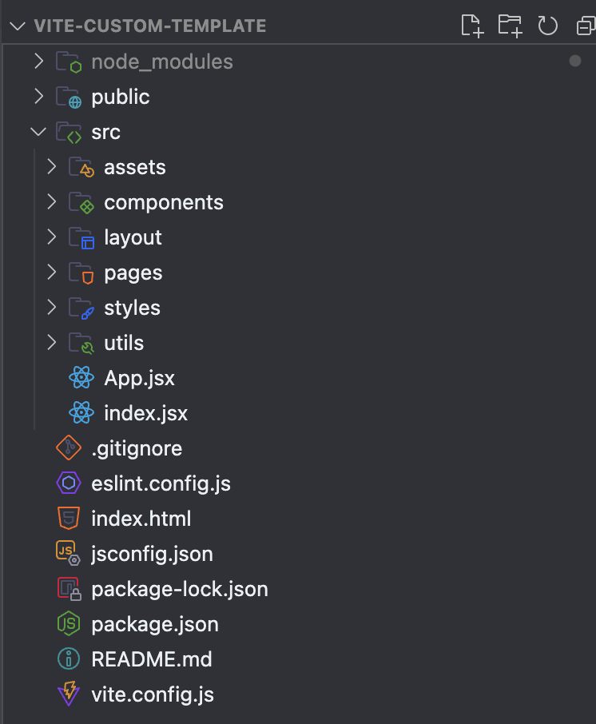

# Vite 커스텀 템플릿
리액트 개발을 위한 나만의 vite 커스텀 템플릿 작성하기
---


🚀 커스텀 템플릿 가져가기 🚀
```
npx degit https://github.com/A-Jamong/j-custom/J-vite-custom my-folder
```

📂 **assets**
icons: 아이콘 파일을 저장하는 폴더입니다. SVG, PNG 등의 아이콘 파일이 위치합니다.
images: 이미지 파일을 저장하는 폴더입니다. 배너, 로고 등 웹사이트에 사용되는 이미지 파일이 위치합니다.

📂 **components**
재사용 가능한 리액트 컴포넌트를 저장하는 폴더입니다. 예를 들어, 버튼, 모달, 폼 요소 등이 포함될 수 있습니다.

📂 **layout**
레이아웃 관련 컴포넌트를 저장하는 폴더입니다. 예를 들어, 헤더, 푸터, 사이드바 등이 포함될 수 있습니다.

📂 **pages**
각 페이지 컴포넌트를 저장하는 폴더입니다. 예를 들어, 홈 페이지, 로그인 페이지, 대시보드 페이지 등이 포함될 수 있습니다.

📂 **styles**
CSS 스타일시트를 저장하는 폴더입니다. 글로벌 스타일과 모듈 스타일 등이 포함될 수 있습니다.
globals.css: 웹사이트 전체에 적용되는 글로벌 스타일을 정의하는 CSS 파일입니다.

📂 **utils**
유틸리티 함수와 헬퍼 함수를 저장하는 폴더입니다. 예를 들어, 날짜 포맷팅, 데이터 변환 함수 등이 포함될 수 있습니다.

📜 **App.jsx**
리액트 애플리케이션의 최상위 컴포넌트입니다. 전체 앱의 구조와 라우팅을 정의합니다.

📜 **index.jsx**
리액트 애플리케이션의 진입점 파일입니다. ReactDOM을 사용하여 리액트 컴포넌트를 HTML DOM에 렌더링합니다.